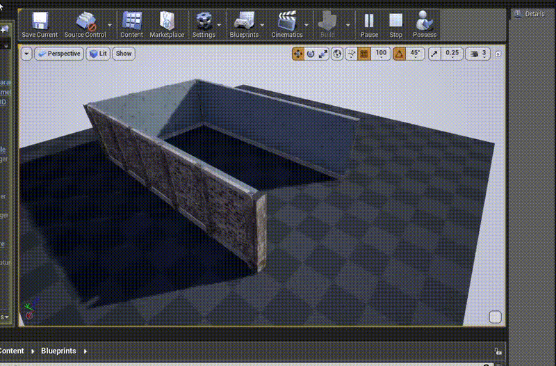

# Hallowed
## An Unreal Engine 4.22 testbed project

Small testbed project  whipped up in a few hours for new engine features and UX.

This repo also contains a rough but useable Unreal version of my [floorplan](https://github.com/alexismorin/floorplan) Unity plugin. Simply drag the *floorplan* folder found inside of the *plugins* folder inside your own Unreal project's *plugins* folder. I'll revisit this for sure, but for now this is the workflow:

- Grab the *Floorplan Handle* blueprint from the plugin folder
- Drag it into the scene (preferably at 0,0,0)
- Assign your modular kit tiles accordingly inside the blueprint - some sample meshes are included
- Start the scene in PIE mode (ew, I know) and drag the actor around!

