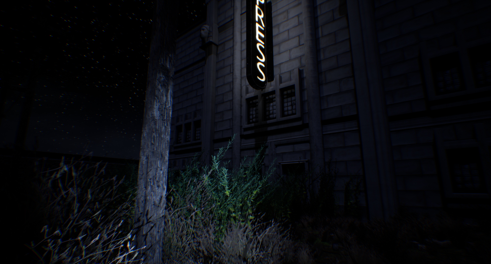

# Hallowed
## An Unreal Engine 4.22 testbed project

Small testbed project  whipped up in a few hours for new engine features and UX.

This repo also contains a rough but useable Unreal version of my [floorplan](https://github.com/alexismorin/floorplan) Unity plugin. Simply drag the *floorplan* folder found inside of the *plugins* folder inside your own Unreal project's *plugins* folder.

